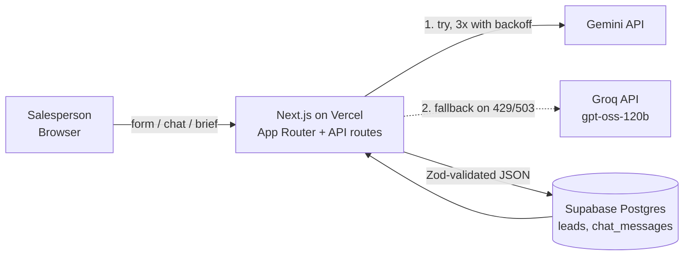

# 📞 CallLoop

**An AI copilot that tells a real-estate salesperson who to call first, what the customer really wants, and exactly what to say.**

🔗 **Live demo:** https://call-loop.vercel.app
🎥 **3-min demo video:** _add link_
💻 **Repo:** https://github.com/sakshamm1006/call-loop

<!-- Add a screenshot or GIF here: docs/hero.png -->

---

## The problem

A sales team gets hundreds of inbound leads a day. The salesperson has no time to read every message, so hot buyers go cold while time is spent on tyre-kickers. Existing tools show a form and a list. They don't answer the three questions that matter in the moment:

1. **Who matters right now?**
2. **What does this customer actually want, and what is worrying them?**
3. **What do I say, and what should I ask?**

## What CallLoop does

| Step | What happens |
|---|---|
| **Intake** | Enter name, location, property requirement, budget, timeline, and the customer's message or chat transcript |
| **Analyze** | An LLM returns a structured analysis: summary, intent, key requirements, objections, next action, suggested reply, **0-100 score, Hot / Warm / Cold tier, urgent flag, and the reasons behind the score** |
| **Prioritize** | All leads are saved and ranked by score. Filter by Hot / Warm / Cold. Urgent leads pulse |
| **Ask** | A chat panel per lead, grounded in that lead's data. Ask "what should I emphasize?" or "make my reply more assertive". Chat history is saved |
| **Prepare** | **Pre-call brief** (my own feature, below) |

### ⭐ My own feature: the Pre-call Brief

A salesperson's real workflow is *before the call, during the call, after the call*. Most tools stop at "analyze the lead". CallLoop adds a one-page cheat sheet you can read in the 30 seconds before you dial:

- **Open with:** a natural first sentence for the call
- **Emphasize:** 3 talking points tied to this customer's requirements
- **If they push back:** likely objections, each with a short rebuttal
- **Ask them:** the missing information that would sharpen the deal (financing status, decision makers, and so on)

The brief is generated from the lead data plus the earlier analysis, and it is stored on the lead so it is there when you come back.

---

## Architecture



**Lead creation flow** (`POST /api/leads`)

1. Validate input, build the lead context.
2. Call the LLM with the scoring rubric and ask for strict JSON.
3. Strip code fences, parse, and **validate with Zod**. Retry once on invalid output.
4. Save the lead with its analysis, score and tier in one insert.
5. The list endpoint returns leads sorted by score.

**Project layout**

```
app/
  page.tsx                    dashboard: intake form, ranked list, tier filters
  leads/[id]/page.tsx         lead detail: analysis cards, chat, pre-call brief
  api/leads/route.ts          GET list (by score) / POST create + analyze
  api/leads/[id]/route.ts     GET lead + chat history
  api/leads/[id]/chat/        grounded chat
  api/leads/[id]/brief/       pre-call brief
lib/
  ai.ts                       model calls, retry, fallback, Zod schemas, prompts
  supabase.ts                 server-side DB client
```

## AI models and how they are called

| Role | Model | Notes |
|---|---|---|
| Primary | **Google Gemini** (free tier), model set via `GEMINI_MODEL` | Called server-side with JSON output mode |
| Fallback | **Groq**, `openai/gpt-oss-120b` (free tier), set via `GROQ_MODEL` | Used automatically if Gemini keeps failing |

All calls go through one function, `callLLM()` in `lib/ai.ts`. It retries Gemini up to 3 times with a growing delay when it sees overload or rate-limit errors (429 / 503), then falls back to Groq. API keys only exist on the server.

**Scoring rubric (in the prompt, so the score is not vibes)**

| Dimension | Weight |
|---|---|
| Timeline urgency | 30 |
| Budget realism vs. requirement | 25 |
| Intent clarity and specificity | 25 |
| Engagement signals in the message | 20 |

Tiers: **Hot ≥ 70, Warm 40-69, Cold < 40.** `urgent` is set when the customer wants to move within roughly two weeks or mentions a competing offer or deadline. The model also returns short **reasons**, and the UI shows them under "Why this score", so a salesperson can see why a lead ranks where it does and disagree with it.

**Grounded chat.** Each chat request injects the lead's fields and its analysis into the system prompt, with an instruction to answer only from that data and to say "not in the lead data" and suggest a question to ask instead of inventing facts. The last 20 messages are replayed for context.

---

## Key technical decisions

- **One Next.js app on Vercel, no separate backend.** One deploy, no cold-start sleeping server, and the reviewer can open the link and it just works.
- **Retry, then fall back to a second provider.** During development Gemini returned 503 "high demand" errors and retired a model name for new keys. A demo that dies on a provider hiccup is a bad demo, so `callLLM()` retries and then switches provider.
- **Structured JSON validated with Zod.** The UI never trusts raw model output. A malformed response is retried and, if it still fails, returns a clean error instead of breaking the page.
- **Explainable score.** Fixed rubric plus reasons, instead of an unexplained number.
- **Grounded, not generic, chat.** Answers come from the lead's own data, which keeps advice specific and reduces hallucination.
- **Server-side keys only.** The Supabase service-role key and both LLM keys are only read inside API routes and are never sent to the browser.
- **Analysis stored as JSON on the lead row.** Fast to build and easy to evolve. The brief lives inside the same JSON.

## Run it locally

```bash
git clone https://github.com/sakshamm1006/call-loop.git
cd call-loop
npm install
```

1. Create a free [Supabase](https://supabase.com) project and run this in the SQL editor:

```sql
create table leads (
  id uuid primary key default gen_random_uuid(),
  name text not null,
  location text,
  requirement text,
  budget text,
  timeline text,
  message text,
  analysis jsonb,
  score int default 0,
  tier text default 'cold',
  created_at timestamptz default now()
);

create table calls (
  id uuid primary key default gen_random_uuid(),
  lead_id uuid references leads(id) on delete cascade,
  notes text,
  score_before int,
  score_after int,
  changes jsonb,
  created_at timestamptz default now()
);

create table chat_messages (
  id uuid primary key default gen_random_uuid(),
  lead_id uuid references leads(id) on delete cascade,
  role text,
  content text,
  created_at timestamptz default now()
);
```

2. Get free API keys from [Google AI Studio](https://aistudio.google.com/apikey) and [Groq](https://console.groq.com/keys).
3. Create `.env.local` in the project root:

```
GEMINI_API_KEY=...
GEMINI_MODEL=gemini-3.8-flash
GROQ_API_KEY=...
GROQ_MODEL=openai/gpt-oss-120b
NEXT_PUBLIC_SUPABASE_URL=...
SUPABASE_SERVICE_ROLE_KEY=...
```

4. `npm run dev` and open http://localhost:3000.

Model names change often on free tiers. If you get a "model not found" error, check the provider's model list and update the env var.

## Tech stack

Next.js (App Router) · TypeScript · Tailwind CSS · Framer Motion · Supabase (Postgres) · Google Gemini API · Groq API · Zod · Vercel

## Known limitations

Being upfront about these:

- **No authentication.** All visitors share one lead list. Fine for a demo, not for production.
- **LLM scores can vary slightly between runs.** The rubric keeps them consistent, but they are not deterministic.
- **Prompt injection.** The customer message goes into the prompt, so a hostile message could try to steer the analysis. Next step would be delimiting untrusted text and adding output checks.
- **Free-tier limits.** Rate limits and provider outages apply. The retry and fallback layer softens this but does not remove it.
- **Chat is not streamed**, so replies appear all at once.
- **The `calls` table is created but not used yet** (see the roadmap).

## Roadmap

The natural next step closes the loop: **before the call, during the call, after the call.**

1. **Post-call debrief.** After the call, add notes (typed or dictated). The AI re-scores the lead and shows *what changed and why* (for example 62 → 81, "buyer confirmed budget"), updates objections and the next action, and drafts the follow-up. This uses the `calls` table already in the schema.
2. **Score history timeline** per lead, so a manager can see momentum.
3. **Hinglish / Hindi reply toggle.** Indian real-estate follow-ups mostly happen on WhatsApp.
4. **Voice dictation** for notes.
5. **Follow-up reminders** and overdue flags.
6. **Streaming chat**, pipeline stages, auth and per-user leads.

## AI usage disclosure

I used **Claude** as a coding assistant for product planning, architecture choices, first drafts of the API routes, UI components and prompts, and for debugging (retired model names, provider overload errors, a misplaced Git repo). Inside the product, **Gemini** and **Groq** power the analysis, chat and pre-call brief. I ran and tested everything myself, made the product decisions (scoring rubric, the pre-call brief, what to cut), set up Supabase and Vercel, and can walk through every file.

---

Built by [Saksham](https://github.com/sakshamm1006) · [LinkedIn](https://linkedin.com/in/sakshamtrivedi07)
